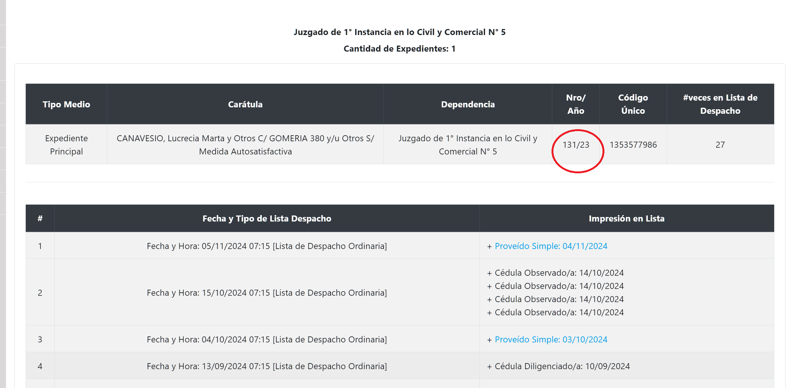
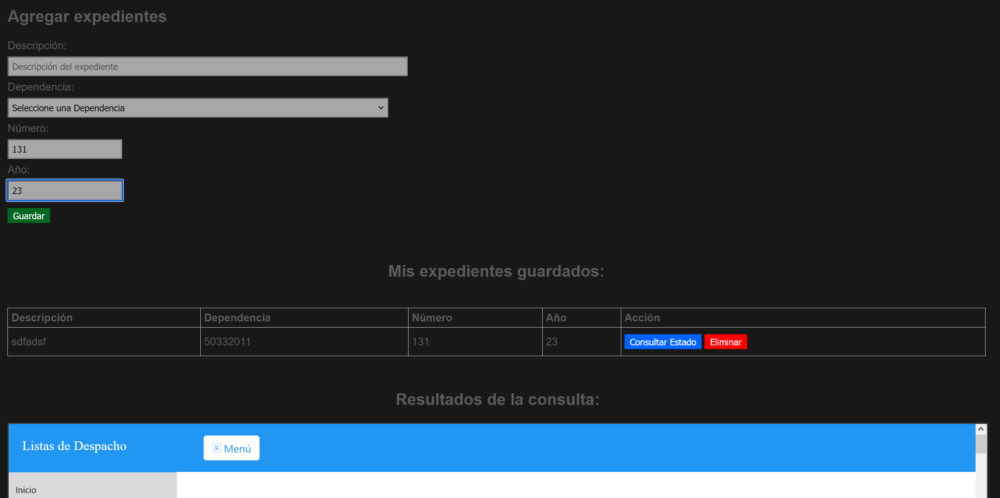

## COMO USAR

- Levantar backend con npm run dev
- levantar el frontend con liveserver en vscode, xampp u otro.

## COMO GUARDAR LOS DATOS A CONSULTAR

- buscamos la lista de despacho como lo hacemos habitualmente, luego anotamos en un papel esos dos numeros como se ve en la imagen (131/23 como se ve en la imagen)
  

- luego podemos guardar en "numero" 131 y en "año" 23.
  

- debemos agregar tambien la dependencia o juzgado.
- en descripcion ponemoos algo que haga referencia.

- LISTO, ya podemos consultar con un click si escribir cada vez que consultamos 😁
